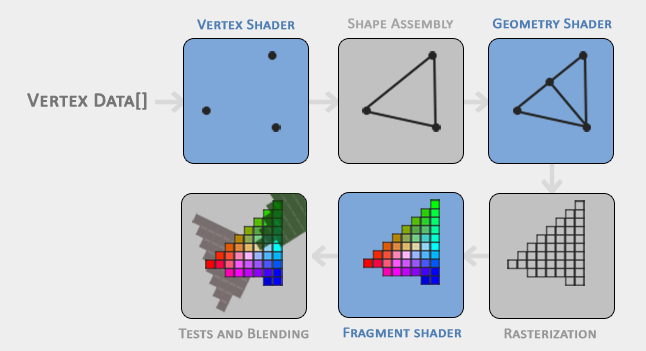
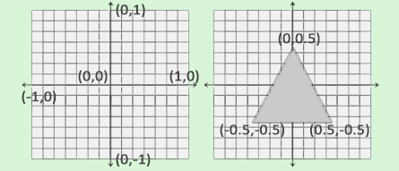

# **The-basis-of-OpenGL**

## О чем этот файл

В данном файле я буду конспектировать некоторые сведения из различных статей на тему графических API, а конкретнее OpenGL. Могу позволить себе излагаться в разговорной манере, объясняя некоторые темы "человеческим языком".

## Краткие сведения

**[OpenGL](https://ru.wikipedia.org/wiki/OpenGL)** - спецификация, определяющая платформонезависимый программный интерфейс для написания приложений, использующих двумерную и трёхмерную компьютерную графику. Если выражаться программерским языком, то это интерфейс, который реализуют производители видеокарт в своей продукции. То-есть видеокарта решает как лучше отрисовать те или иные координаты / меши и тд.

OpenGL, как и другие спецификации (Vulkan, DirectX), позволяющие работать с видеокартой, предоставляет общий интерфейс с функциями, с помощью которых разработчик может на более низком уровне работать с прорисовкой графического интерфейса.

## Графический конвейер (Graphics pipeline)

### Шейдеры

Суть графического конвейера состоит в преобразовании 3Д координат (входных вершин) в окрашенные 2Д пиксели (растеризации и "окраска"). Ранее, этой задачей занимался CPU - центральный процессор, но прогресс не стоит на месте и чтобы разгрузить бедолагу, на помощь ему пришли процессорные ядра видеокарты, коих насчитываются тысячи. Это позволило программистам самим писать программы для того самого преобразования 3Д координат в 2Д. Кстати, эти программами и являются <u>шейдеры</u>.

**[Шейдеры](coremission.net/gamedev/chto-takoe-sheidery/)** - это программа для видео карточки, которая используется в трёхмерной графике для определения окончательных параметров объекта или изображения, может включать в себя описание поглощения и рассеяния света, наложения текстуры, отражения и преломление, затенение, смещение поверхности и множество других параметров.

### Стадии конвейерной отрисовки

Выше, можно заметить сам графический конвейер и этапы конвейерной отрисовки. Обратим внимание, что этапы, зарисованные синим, могут быть запрограммированы вручную.

1. **Vertex Shader** (шейдеры вершин) - отрисовка вершин.
2. **Shape Assembly** (Сборка формы) - на вход идут вершины и примитив отрисовки (напр. GL_POINTS).
3. **Geometry Shader** (шейдер геометрии) - принимает на вход данные первого и второго пункта. Задача: соединить некоторые вершины, тем самым получив новую фигуру.
4. **Rasterization** (растеризация) - получив на вход данные из пункта 3, преобразует примитив (ы) в растровое изображение, тоесть разбиение фигуры на пиксели. Также, на этом этапе, производится обрезка фрагментов, которые не видны пользователю, для улучшения производительности.
5. **Fragment Shaders** (Фрагментный шейдер) - разрисовка (наложение цвета) растрового изображения пункта 4
6. **Tests and Blending** (тесты и смешивание) - определение прозрачности/непрозрачности, проверка значений глубины.

### [Виды шейдеров](https://coremission.net/gamedev/chto-takoe-sheidery/)

Окей, с графическим конвейером немного разобрались, да и базу по шейдерам я немного осветил. Рассмотрим же их (вновь) по-подробнее.

Всего есть 3(4) вида шейдеров и у каждого из них свое предназначение.

#### Вершинные шейдеры (Vertex shaders)

Вершинными шейдерами делают анимации персонажей, травы, деревьев, создают волны на воде и многие другие штуки. В вершинном шейдере программисту доступны данные, связанные с вершинами например: координаты вершины в пространстве, её текстурные координатами, её цвет и вектор нормали.

#### Геометрический шейдер (Geometry shaders)

Геометрические шейдеры способны создавать новую геометрию, и могут использоваться для создания частиц, изменения детализации модели «на лету», создание силуэтов и т.п. В отличие от предыдущего вершинного, способны обработать не только одну вершину, но и целый примитив. Примитивом может быть отрезок (две вершины) и треугольник (три вершины), а при наличии информации о смежных вершинах (англ. adjacency) для треугольного примитива может быть обработано до шести вершин. Пиксельный шейдер Пиксельными шейдерами выполняют наложение текстур, освещение, и разные текстурные эффекты, такие как отражение, преломление, туман, Bump Mapping и пр. 

#### Фрагментные (пиксельные) шейдеры (Fragment shaders)

Используются для пост-эффектов. Пиксельный шейдер работает с фрагментами растрового изображения и с текстурами — обрабатывает данные, связанные с пикселями (например, цвет, глубина, текстурные координаты). Пиксельный шейдер используется на последней стадии графического конвейера для формирования фрагмента изображения.

## Давайте рисовать

### Подготовка

Как мы поняли из вышесказанного, для работы с графикой нам нужно скормить 3Д координаты вершин нашей видеокарте, используя арсенал методов OpenGL. Воспользуемся рисунком из главы <u>Стадии конвейерной обработки</u> и приступим к работе.

### Vertex Buffer Object (VBO)

